# Conversation map

Every branch the simulator can take. This mirrors `data/conversations.js` —
**that file is the source of truth for the graph** — and this diagram is the
readable version for GitHub. The numbers/drivers the newer scenarios quote live
in `data/sample-data.js` (the sample-data store); conversation nodes ground
their charts and results on it.

The node table below is **machine-written**: CI regenerates and commits it on
every PR (locally: `node scripts/check-graph.js --fix-map`). The Mermaid
diagram and the prose are curated by hand — edit those freely.

```mermaid
flowchart TD
    connect["🔌 Connect the connector"] --> authorize["Authorize"]
    authorize -->|auto| hub{{"Pick a question (hub)"}}

    %% --- Productivity ---
    hub -->|"📋 Weekly review"| ep1["Ep1 · Weekly review"]
    hub -->|"🛠️ weekly review as a skill"| ep1sf["Ep1 · Run it once first"]
    ep1sf -->|auto| ep1
    hub -->|"⚡ 5 fleet chores"| ep4["Ep4 · Five actions"]

    %% --- Safety ---
    hub -->|"❓ Why speeding up?"| ep2["Ep2 · Ask why"]
    hub -->|"🛣️ Was that road that fast?"| ep10["Ep10 · Posted-speed check"]
    hub -->|"🚦 Riskiest drivers?"| epSR["Safety · Driver safety scorecard"]
    hub -->|"🛑 Harsh braking by driver"| epSH["Safety · Harsh braking by driver"]
    hub -->|"🏫 School-zone speeding?"| epSS["Safety · School zones"]
    hub -->|"🤖 Ask Geotab Ace"| ep7["Ep7 · Ask Geotab Ace"]
    epSH -->|"map the worst driver"| epSHs["Safety · Harsh-braking hotspot"]
    epSS -->|"make it enforceable"| epSSc["Safety · School-zone alert (write)"]

    %% --- Compliance / Sustainability ---
    hub -->|"🌍 Low-emission zone"| ep3["Ep3 · Zone from the news"]
    hub -->|"🚐 What's in my fleet?"| ep9h["Ep9 · Fleet mix + EV"]

    %% --- Maintenance ---
    hub -->|"🔧 Triage maintenance"| ep8["Ep8 · Triage the worklist"]
    hub -->|"📅 Overdue for service?"| epMO["Maint · Overdue service"]
    hub -->|"⚠️ Fault codes + severity"| epMS["Maint · Fault severity"]
    hub -->|"⏱️ Most downtime?"| epMD["Maint · Unplanned downtime"]
    hub -->|"❓ Why does Demo-08 fault?"| ep12["Ep12 · Investigation loop"]
    hub -->|"📧 Fault → email → book"| ep5["Ep5 · Geotab + Gmail + Calendar"]

    %% --- Operations ---
    hub -->|"⛽ Fuel economy by type"| epOF["Ops · Fuel economy"]
    hub -->|"💤 Longest idle times"| epOI["Ops · Idle times"]
    hub -->|"🔋 EV-replacement candidates"| epEVv["Ep9 · EV case (Vegas)"]
    epOI -->|"create rule"| epOIa["Ops · Idling alert (write)"]

    %% --- Agentic ---
    hub -->|"🛡️ Top 3 safety risks + fixes"| epAS["Agentic · Assess risks"]
    hub -->|"🧑‍🏫 Draft coaching notes"| epAC["Agentic · Coaching draft"]
    epAC -->|"send"| epACs["Agentic · Send summary (write)"]

    %% --- Business case (ROI) — the convergence point ---
    hub -->|"💰 Where's the money leaking?"| epROI["ROI · Recoverable savings"]
    epROI -->|"draft one-pager"| epROIp["ROI · Business case (Gmail)"]
    epROIp -->|"send"| epROIs["ROI · Send (write)"]
    epX -->|"💰 put dollars on it"| epROI
    epAS -->|"💰 what's it worth"| epROI
    epOF -->|"💰 roll into ROI"| epROI

    %% --- Dispatch & cross-tool ---
    hub -->|"🚐 Closest vehicle?"| epD["Ep-Dispatch · Closest available"]
    hub -->|"💼 Salesforce dispute"| ep13["Ep13 · Geotab + Salesforce"]
    hub -->|"📊 Board snapshot"| epX["Ep-Exec · Both fleets snapshot"]

    %% A few representative cross-links (full set in conversations.js)
    ep2 -->|"🔔 Flag it live"| ep2a["Ep2 · Create alert"]
    epSR -->|"🧑‍🏫 Coach"| epAC
    epSR -->|"🔔 Alert"| ep2a
    epAS -->|"✅ Do #1"| ep2a
    epMS --> ep12
    epMD --> ep12
    epOF --> epEVv

    %% --- Package-as-a-skill beats (Ep1 shapes the review in conversation first) ---
    ep1 -->|"📊 chart the speeding"| ep1v["Ep1 · Shape: chart it"]
    ep1v -->|"🧾 headline + 3 bullets"| ep1b["Ep1 · Shape: reshaped brief"]
    ep1b -->|"🛠️ freeze the shaped review"| ep1s["Ep1 · Weekly-review skill"]
    epSR -->|"🛠️ skill"| epSRs["Skill · Safety scorecard"]
    ep8 -->|"🛠️ skill"| ep8s["Skill · Maintenance triage"]
    epROI -->|"🛠️ skill"| epROIsk["Skill · Quarterly ROI case"]

    %% --- Warehouse (MotherDuck teaching path) ---
    hub -->|"🦆 Build a MotherDuck warehouse"| wh["Warehouse · intro → setup → first load → layering → incremental → operational mirror → quality → costs → answers"]
```

## Nodes (92)

| id | title | database | leads to |
|---|---|---|---|
| `connect` | Connect the connector | — | `authorize` |
| `authorize` | Authorize | — | `hub` (auto) |
| `hub` | Pick a question (hub) | — | `ep1-answer`, `ep-agentic-safety`, `warehouse-intro`, `ep-roi`, `ep-safety-risk`, `ep-safety-harsh`, `ep-safety-schoolzone`, `ep2-answer`, `ep10-postedspeed`, `ep7-ace`, `ep8-maintenance`, `ep-maint-overdue`, `ep-maint-severity`, `ep-maint-downtime`, `ep12-investigate`, `ep5-answer`, `ep-ops-fuel`, `ep-ops-idle`, `ep9-ev-vegas`, `ep9-fleet-hub`, `ep3-answer`, `ep-zonelife-answer`, `ep1-skill-first`, `ep4-answer`, `ep-agentic-coaching`, `ep-dispatch`, `ep13-salesforce`, `ep-exec` |
| `ep1-answer` | Ep1 · Weekly review | demo_fh_vegas4 | `ep1-shape-viz`, `ep7-ace`, `hub` |
| `ep1-shape-viz` | Ep1 · Shape it: chart the speeding | demo_fh_vegas4 | `ep1-shape-brief`, `hub` |
| `ep1-shape-brief` | Ep1 · Shape it: the reshaped brief | — | `ep1-skill`, `hub` |
| `ep1-skill-first` | Ep1 · Run it once before packaging | — | `ep1-answer` (auto) |
| `ep1-skill` | Ep1 · Package as a skill | — | `ep9-fleet`, `hub`, restart |
| `ep-safety-skill` | Skill · Package the safety scorecard | — | `ep-safety-risk`, `ep-agentic-coaching`, `hub`, restart |
| `ep-maint-skill` | Skill · Package the maintenance triage | — | `ep8-maintenance`, `ep-maint-overdue`, `hub`, restart |
| `ep-roi-skill` | Skill · Package the quarterly ROI case | — | `ep-roi-onepager`, `ep-roi`, `hub`, restart |
| `ep2-answer` | Ep2 · Ask why | demo_fh_vegas4 | `ep2-action`, `ep10-postedspeed`, `hub` |
| `ep2-action` | Ep2 · Create alert | demo_fh_vegas4 | `ep8-maintenance`, `hub`, restart |
| `ep3-answer` | Ep3 · Zone from the news | demo_fh4 | `ep3-prefs`, `ep9-fleet-23-31`, `hub` |
| `ep3-prefs` | Ep3 · Alert preferences | demo_fh4 | `ep3-action`, `ep3-action-wide` |
| `ep3-action` | Ep3 · Create zone + rule | demo_fh4 | `ep3-map`, `hub`, restart |
| `ep3-action-wide` | Ep3 · Create zone + rule (entry+exit, group) | demo_fh4 | `ep3-map`, `hub`, restart |
| `ep3-map` | Ep3 · ZBE zone on a map | — | `ep9-fleet-23-31`, `hub`, restart |
| `ep-zonelife-answer` | Ops · Zone & rule lifecycle test | demo_fh_vegas4 | `ep-zonelife-create`, `hub` |
| `ep-zonelife-create` | Ops · Create test zone + rule | demo_fh_vegas4 | `ep-zonelife-delete` |
| `ep-zonelife-delete` | Ops · Delete + verify zone/rule | demo_fh_vegas4 | `ep-zonelife-safety`, `ep-zonelife-cascade`, `hub`, restart |
| `ep-zonelife-safety` | Ops · What deleting a rule clears (and how to check first) | demo_fh_vegas4 | `ep-zonelife-skill`, `ep-zonelife-cascade`, `hub`, restart |
| `ep-zonelife-skill` | Skill · Package the pre-delete safety check | demo_fh_vegas4 | `hub`, restart |
| `ep-zonelife-cascade` | Ops · Delete order — zone before rule | demo_fh_vegas4 | `hub`, restart |
| `ep4-answer` | Ep4 · Five actions | demo_fh4 | `ep8-maintenance`, `ep9-fleet-23-31`, `hub`, restart |
| `ep5-answer` | Ep5 · Geotab + Gmail + Calendar | demo_fh4 | `ep5-send`, `ep5-hold` |
| `ep5-send` | Ep5 · Send the draft | demo_fh4 | `ep9-fleet-06`, `hub`, restart |
| `ep5-hold` | Ep5 · Hold the email, keep the slot | demo_fh4 | `ep9-fleet-06`, `hub`, restart |
| `ep13-salesforce` | Ep13 · Geotab + Salesforce | demo_fh4 | `ep13-close`, `ep13-leaveopen` |
| `ep13-close` | Ep13 · Close the case | demo_fh4 | `ep9-fleet-12`, `hub`, restart |
| `ep13-leaveopen` | Ep13 · Leave the case open | demo_fh4 | `ep9-fleet-12`, `hub`, restart |
| `ep7-ace` | Ep7 · Ask Geotab Ace | demo_fh_vegas4 | `ep7-reasoning`, `ep2-action`, `hub` |
| `ep7-reasoning` | Ep7 · Ace reasoning | demo_fh_vegas4 | `ep8-maintenance`, `ep1-answer`, `hub`, restart |
| `ep8-maintenance` | Ep8 · Triage the worklist | demo_fh4 | `ep-maint-skill`, `ep9-fleet-08`, `ep12-investigate`, `ep5-answer`, `hub` |
| `ep9-fleet-08` | Ep9 · What is Demo - 08 | demo_fh4 | `ep12-investigate`, `ep5-answer`, `ep9-fleet`, `hub` |
| `ep9-fleet-06` | Ep9 · What is Demo - 06 | demo_fh4 | `ep9-fleet`, `hub`, restart |
| `ep9-fleet-12` | Ep9 · What is Demo - 12 | demo_fh4 | `ep9-fleet`, `hub`, restart |
| `ep9-fleet-23-31` | Ep9 · What are Demo - 23 & Demo - 31 | demo_fh4 | `ep9-fleet`, `hub`, restart |
| `ep9-fleet-01-vegas` | Ep9 · What is Demo - 01 (Vegas) | demo_fh_vegas4 | `ep9-fleet-vegas`, `hub`, restart |
| `ep9-fleet-vegas` | Ep9 · What's in the Vegas fleet | demo_fh_vegas4 | `ep9-ev-vegas`, `ep2-answer`, `hub`, restart |
| `ep9-fleet-hub` | Ep9 · Fleet mix + EV candidates | demo_fh4 | `ep9-fleet-chart`, `ep3-answer`, `ep9-ev`, `hub`, restart |
| `ep9-fleet` | Ep9 · What's in the fleet | demo_fh4 | `ep9-fleet-chart`, `ep3-answer`, `ep9-ev`, `hub`, restart |
| `ep9-fleet-chart` | Ep9 · Fleet composition chart | — | `ep3-answer`, `ep9-ev`, `hub`, restart |
| `ep9-ev` | Ep9 · EV-conversion case (Sprinters) | demo_fh4 | `ep3-answer`, `hub`, restart |
| `ep9-ev-vegas` | Ep9 · EV-conversion case (Vegas) | demo_fh_vegas4 | `ep2-answer`, `hub`, restart |
| `ep10-postedspeed` | Ep10 · Posted-speed truth-check | demo_fh_vegas4 | `ep2-action`, `ep-dashcam`, `ep9-fleet-01-vegas`, `hub` |
| `ep12-investigate` | Ep12 · Investigation loop | demo_fh4 | `ep5-answer`, `ep8-maintenance`, `hub`, restart |
| `ep-dispatch` | Ep-Dispatch · Closest available vehicle | demo_fh_vegas4 | `ep-dispatch-chart`, `ep-dispatch-map`, `ep-dispatch-send-45`, `ep-dispatch-send-50`, `hub`, restart |
| `ep-dispatch-send-45` | Ep-Dispatch · Dispatch Demo - 45 | demo_fh_vegas4 | `hub`, restart |
| `ep-dispatch-send-50` | Ep-Dispatch · Dispatch Demo - 50 | demo_fh_vegas4 | `hub`, restart |
| `ep-dispatch-map` | Ep-Dispatch · Live positions map | — | `ep-dispatch-send-45`, `hub`, restart |
| `ep-dispatch-chart` | Ep-Dispatch · Distance chart | — | `ep-dispatch-send-50`, `hub`, restart |
| `ep-exec` | Ep-Exec · Board snapshot, both fleets | — | `ep-roi`, `ep-exec-chart`, `ep2-answer`, `ep8-maintenance`, `hub`, restart |
| `ep-exec-chart` | Ep-Exec · Utilization & exceptions charts | — | `ep2-answer`, `ep8-maintenance`, `hub`, restart |
| `ep-dashcam` | Ep-Dashcam · Pull the clip (illustrative) | demo_fh_vegas4 | `ep2-action`, `hub`, restart |
| `ep-safety-risk` | Safety · Riskiest drivers this week | demo_fh_vegas4 | `ep-safety-skill`, `ep-agentic-coaching`, `ep-safety-harsh`, `ep2-action`, `hub` |
| `ep-safety-harsh` | Safety · Harsh braking by driver | demo_fh_vegas4 | `ep-safety-harsh-spain`, `ep-agentic-coaching`, `ep-safety-risk`, `hub` |
| `ep-safety-harsh-spain` | Safety · Harsh-braking hotspot | demo_fh_vegas4 | `ep-agentic-coaching`, `ep-safety-risk`, `hub`, restart |
| `ep-safety-schoolzone` | Safety · Speeding in school zones | demo_fh_vegas4 | `ep-safety-schoolzone-create`, `ep-agentic-coaching`, `ep-safety-postedspeed-08`, `hub` |
| `ep-safety-schoolzone-create` | Safety · Create school-zone alert | demo_fh_vegas4 | `ep-agentic-coaching`, `ep-safety-risk`, `hub`, restart |
| `ep-safety-postedspeed-08` | Safety · Posted-speed truth-check (Demo - 08) | demo_fh_vegas4 | `ep-agentic-coaching`, `ep-safety-schoolzone-create`, `hub` |
| `ep-maint-overdue` | Maintenance · Overdue for service | demo_fh4 | `ep-maint-overdue-book`, `ep-maint-severity`, `ep-maint-downtime`, `hub` |
| `ep-maint-severity` | Maintenance · Fault codes + severity | demo_fh4 | `ep-maint-severity-book`, `ep12-investigate`, `ep-maint-downtime`, `hub` |
| `ep-maint-overdue-book` | Maintenance · Book the overdue ITV (Demo - 25) | demo_fh4 | `ep-maint-severity`, `ep-maint-downtime`, `hub`, restart |
| `ep-maint-severity-book` | Maintenance · Book the 3 red-lamp units | demo_fh4 | `ep12-investigate`, `ep-maint-overdue`, `hub`, restart |
| `ep-maint-downtime` | Maintenance · Unplanned downtime | demo_fh4 | `ep12-investigate`, `ep-maint-severity`, `ep-maint-overdue`, `hub` |
| `ep-ops-fuel` | Operations · Fuel economy by type | demo_fh_vegas4 | `ep9-ev-vegas`, `ep-ops-idle`, `ep2-action`, `ep-roi`, `hub` |
| `ep-ops-idle` | Operations · Longest idle times | demo_fh_vegas4 | `ep-ops-idle-alert`, `ep-ops-fuel`, `hub` |
| `ep-ops-idle-alert` | Operations · Create idling alert | demo_fh_vegas4 | `ep-ops-fuel`, `hub`, restart |
| `ep-agentic-safety` | Agentic · Top 3 safety risks + fixes | demo_fh_vegas4 | `ep2-action`, `ep-agentic-coaching`, `ep-safety-schoolzone-create`, `ep-roi`, `ep-safety-risk`, `hub` |
| `ep-agentic-coaching` | Agentic · Draft coaching summary | demo_fh_vegas4 | `ep-coaching-send`, `ep-agentic-safety`, `ep2-action`, `hub` |
| `ep-coaching-send` | Agentic · Send coaching summary | demo_fh_vegas4 | `ep2-action`, `hub`, restart |
| `warehouse-intro` | Warehouse · simplest path | — | `warehouse-setup`, `warehouse-geotab-recommendation`, `warehouse-what-is`, `hub` |
| `warehouse-geotab-recommendation` | Warehouse · Geotab recommendation? | — | `warehouse-setup`, `warehouse-freshness`, `warehouse-what-is`, `warehouse-intro` |
| `warehouse-what-is` | Warehouse · what is MotherDuck | — | `warehouse-setup`, `warehouse-intro`, `hub` |
| `warehouse-setup` | Warehouse · get many points | — | `warehouse-first-load`, `hub` |
| `warehouse-first-load` | Warehouse · one-table load | — | `warehouse-layering`, `hub` |
| `warehouse-layering` | Warehouse · why layers appear | — | `warehouse-incremental`, `hub` |
| `warehouse-incremental` | Warehouse · incremental refresh | — | `warehouse-operational`, `warehouse-freshness`, `warehouse-backfill`, `warehouse-intro`, `hub`, restart |
| `warehouse-operational` | Warehouse · operational mirror | — | `warehouse-restated`, `warehouse-enrichment`, `warehouse-deletions`, `hub` |
| `warehouse-restated` | Warehouse · trips aren't append-only | — | `warehouse-quality`, `warehouse-operational`, `hub` |
| `warehouse-quality` | Warehouse · quality and gaps | — | `warehouse-costs`, `warehouse-answers`, `warehouse-backfill`, `warehouse-restated`, `hub` |
| `warehouse-costs` | Warehouse · cost estimate | — | `warehouse-downsample`, `warehouse-answers`, `warehouse-quality`, `hub` |
| `warehouse-answers` | Warehouse · answer-ready marts | — | `warehouse-enrichment`, `warehouse-quality`, `warehouse-intro`, `hub` |
| `warehouse-freshness` | Warehouse · why watermarks, not GetFeed | — | `warehouse-backfill`, `warehouse-setup`, `warehouse-incremental`, `hub` |
| `warehouse-backfill` | Warehouse · falling behind, and noticing | — | `warehouse-quality`, `warehouse-freshness`, `warehouse-incremental`, `hub` |
| `warehouse-enrichment` | Warehouse · faults get coordinates | — | `warehouse-answers`, `warehouse-quality`, `warehouse-operational`, `hub` |
| `warehouse-deletions` | Warehouse · deletions & mutability | — | `warehouse-restated`, `warehouse-quality`, `warehouse-operational`, `hub` |
| `warehouse-downsample` | Warehouse · downsample, never at ingest | — | `warehouse-answers`, `warehouse-costs`, `hub` |
| `ep-roi` | ROI · Where the fleet leaks money | demo_fh_vegas4 | `ep-roi-onepager`, `ep-roi-skill`, `ep2-action`, `ep-agentic-coaching`, `hub` |
| `ep-roi-onepager` | ROI · Draft the business case | demo_fh_vegas4 | `ep-roi-send`, `ep2-action`, `hub` |
| `ep-roi-send` | ROI · Send the business case | demo_fh_vegas4 | `ep2-action`, `hub`, restart |

Episodes **cross-link** as well as branch to their own action node — e.g.
maintenance → fleet composition → Valencia exposure, or speeding → posted-speed
→ live alert → dashcam — so the same entry points open many distinct paths.
`ep-dispatch` and `ep-exec` are grounded entirely from live MCP calls.

The **Safety / Maintenance / Operations / Agentic** scenarios are anchored to
the live demo accounts (API + Ace) — fleet sizes, vehicle mix, the fleet-wide
speeding pattern, and the Sprinter fault cluster are all real — but the demo
databases are sparse (no driver assignments, only speeding exceptions, only
GO-device faults). Since these scenarios are meant to show what a **real,
fully-instrumented customer** sees, the analytics in them are built out with
**realistic, fictional data grounded in genuine Geotab capabilities**:

- Drivers are **named and assigned** (Driver ID), as a real fleet runs — so
  "riskiest drivers" returns a proper **Driver Safety Scorecard** (weighted
  score, event mix, trend vs benchmark), not a vehicle list.
- **Harsh braking by driver** grades events by severity (g-force) and maps the
  worst driver's events to a single intersection — a route problem, not just a
  driver one.
- **Fault severity** triages into red / amber / informational, pulling 3
  genuinely critical faults out of the 597-record noise.
- **School zones**, **overdue service**, **downtime**, **fuel economy** and
  **idling** all return confident, quantified answers (with $ / CO₂ impact and
  named drivers) — the experience a customer with reminders, rules and Driver ID
  configured would actually get.
- Driver names are **fictional demo data** (noted inline and in the README),
  and write-actions point at test mailboxes / sandbox records — no real PII.

New bifurcations slot in by adding a node and a choice — see the README's
"Extending the graph" section.
