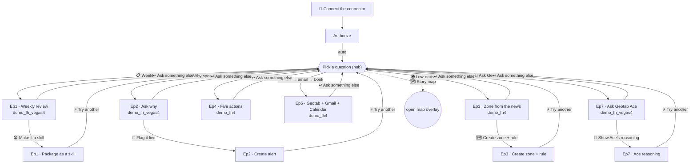

# Conversation map

Every branch the simulator can take. This mirrors `data/conversations.js` — the
**live in-app 🗺️ Story map is the source of truth** (generated from the graph at
runtime), and this diagram is the readable version for GitHub.

## Nodes (13)

| id | title | database | leads to |
|---|---|---|---|
| `connect` | Connect the connector | — | `authorize` |
| `authorize` | Authorize | — | `hub` (auto) |
| `hub` | Pick a question | — | the six episodes + map |
| `ep1-answer` | Weekly review | demo_fh_vegas4 | `ep1-skill`, `hub` |
| `ep1-skill` | Package as a skill | — | `hub`, restart |
| `ep2-answer` | Ask why | demo_fh_vegas4 | `ep2-action`, `hub` |
| `ep2-action` | Create alert | demo_fh_vegas4 | `hub`, restart |
| `ep3-answer` | Zone from the news | demo_fh4 | `ep3-action`, `hub` |
| `ep3-action` | Create zone + rule | demo_fh4 | `hub`, restart |
| `ep4-answer` | Five actions | demo_fh4 | `hub`, restart |
| `ep5-answer` | Geotab + Gmail + Calendar | demo_fh4 | `hub`, restart |
| `ep7-ace` | Ask Geotab Ace | demo_fh_vegas4 | `ep7-reasoning`, `hub` |
| `ep7-reasoning` | Ace reasoning | demo_fh_vegas4 | `hub`, restart |

Each `*-answer` episode currently has **one** action branch plus "ask something
else". New bifurcations (more follow-ups, deeper "why" chains, alternate
databases) slot in by adding a node and a choice — see the README's "Extending
the graph" section.
