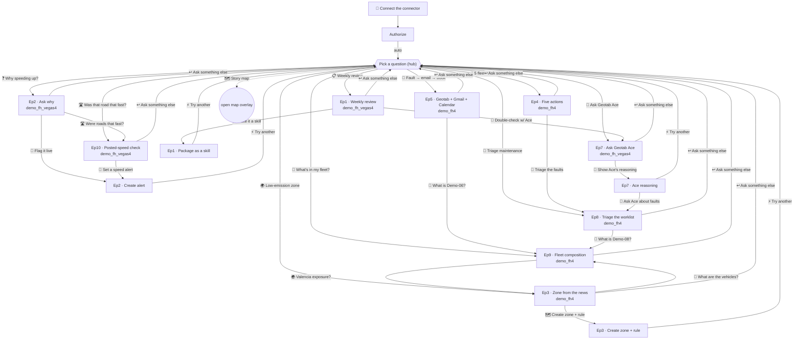

# Conversation map

Every branch the simulator can take. This mirrors `data/conversations.js` — the
**live in-app 🗺️ Story map is the source of truth** (generated from the graph at
runtime), and this diagram is the readable version for GitHub.

## Nodes (16)

| id | title | database | leads to |
|---|---|---|---|
| `connect` | Connect the connector | — | `authorize` |
| `authorize` | Authorize | — | `hub` (auto) |
| `hub` | Pick a question | — | the nine episodes + map |
| `ep1-answer` | Weekly review | demo_fh_vegas4 | `ep1-skill`, `ep7-ace`, `hub` |
| `ep1-skill` | Package as a skill | — | `hub`, restart |
| `ep2-answer` | Ask why | demo_fh_vegas4 | `ep2-action`, `ep10-postedspeed`, `hub` |
| `ep2-action` | Create alert | demo_fh_vegas4 | `hub`, restart |
| `ep3-answer` | Zone from the news | demo_fh4 | `ep3-action`, `ep9-fleet`, `hub` |
| `ep3-action` | Create zone + rule | demo_fh4 | `hub`, restart |
| `ep4-answer` | Five actions | demo_fh4 | `ep8-maintenance`, `hub`, restart |
| `ep5-answer` | Geotab + Gmail + Calendar | demo_fh4 | `ep9-fleet`, `hub`, restart |
| `ep7-ace` | Ask Geotab Ace | demo_fh_vegas4 | `ep7-reasoning`, `hub` |
| `ep7-reasoning` | Ace reasoning | demo_fh_vegas4 | `ep8-maintenance`, `hub`, restart |
| `ep8-maintenance` | Triage the worklist | demo_fh4 | `ep9-fleet`, `hub` |
| `ep9-fleet` | Fleet composition | demo_fh4 | `ep3-answer`, `hub`, restart |
| `ep10-postedspeed` | Posted-speed check | demo_fh_vegas4 | `ep2-action`, `hub` |

Episodes now **cross-link** as well as branch to their own action node — e.g.
maintenance → fleet composition → Valencia exposure, or speeding → posted-speed
→ live alert — so the same nine entry points open many distinct paths. New
bifurcations slot in by adding a node and a choice — see the README's
"Extending the graph" section.
